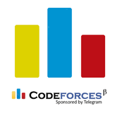
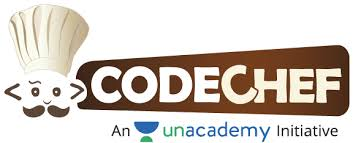

### Hi there 👋

<!--
**tamojit2000/tamojit2000** is a ✨ _special_ ✨ repository because its `README.md` (this file) appears on your GitHub profile.

Here are some ideas to get you started:

- 🔭 I’m currently working on ...
- 🌱 I’m currently learning ...
- 👯 I’m looking to collaborate on ...
- 🤔 I’m looking for help with ...
- 💬 Ask me about ...
- 📫 How to reach me: ...
- 😄 Pronouns: ...
- ⚡ Fun fact: ...
-->

Myself **Tamojit Das** pursuing my bachelors degree in computer science and engineering from Institute of Engineering and Management, Kolkata. I am a fond of Machine Learning and Competitive Programming. I make Desktop Applications, Android Aplications, and Web Apps and give equal weightage to all of them. Sometimes i contribute to Open Source Projects.

 
 

# My Activities:

[ Hackerrank](https://www.hackerrank.com/tamojitdas2000)  
[ Codeforces](https://codeforces.com/profile/Tamojit)  
[ Codechef](https://www.codechef.com/users/tamojit2000)  
[ Kaggle](https://www.kaggle.com/tamojitdas2000)  
[  Dev](https://dev.to/tamojit2000) 

 
 

# Github Activity📊:

